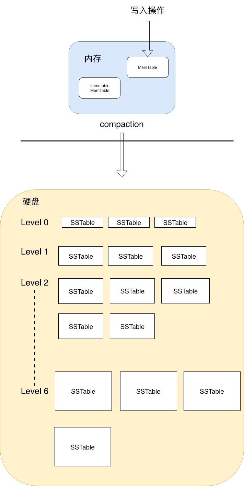
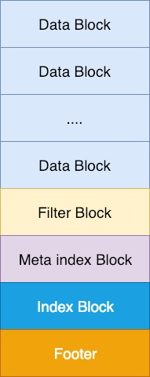
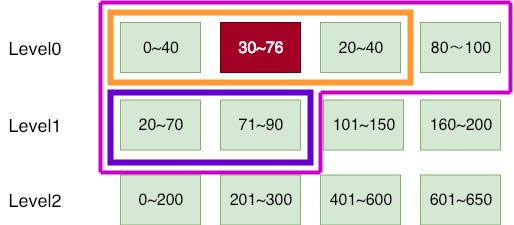
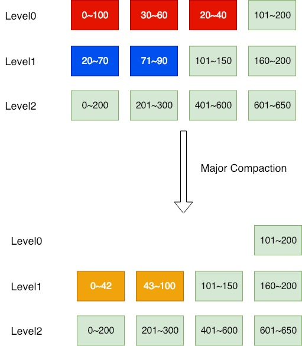

# LevelDB阅读笔记

最近花了点时间学习了一下LevelDB，这里是一些学习心得，打算记录下来，并打算慢慢完善。因为LevelDB中有许多实现的细节非常巧妙，比如用到的Lock-free programming，多线程的处理，LevelDB编码方式，batchWrite用到的生产者消费者模型等，因为我C++基本功并不扎实，所以有的实现细节要慢慢领悟，理解后我会再写在这里。

## LevelDB的背景

LevelDB是Google出品的一个单机版KV存储引擎，Google大名鼎鼎的Big Table就是构建于LevelDB之上的。LevelDB是一个适用于写多读少的数据库，里面最核心的思想就是LSM，LSM更多是一种思想而不是一种算法，LevelDB通过LSM的实现方式，减少随机写的次数，提高了写入的效率，并且通过Compaction这种内部的数据整合机制，达到了平衡读写速率的效果。在[这里](http://www.lmdb.tech/bench/microbench/benchmark.html)可以看到在每个KV都不是非常大（100,000 bytes each）的时候,LevelDB都有不俗的表现。

## LevelDB总体架构

其实数据库无外乎就是要解决两个问题，**怎么存储数据**，**怎么读取数据**。为了解决上面的两个核心问题，就需要数据库这样一个调度系统，而内存和硬盘就是被调度的对象，解决好了内存和硬盘之间的互动关系，自然也就能理解数据库是怎么读写数据了。我们可以先看一下LevelDB的概括图：



在这个图里面确实还有很多别的东西没有包括进来，比如log文件，manifest文件，current文件等，这些是用来做数据恢复，记录数据库版本的，关于这些部分的内容我以后会慢慢完善，现在暂时不会涉及到。

从概括图我们可以看到会有以下几个比较重要的元素，**Memtable**, **Immutable Memtable**, **Compaction**, **Level0 ~ Level6**, **SSTable**, 我们会分成每个小部分来讲解，最后会把这所有的元素联系起来。

---

## Memtable

在LevelDB的里面，Memtable是完全存在于内存里面的，其核心就是一个**跳表(skiplist)**，所有的KV都是根据Key排好序的，所以在设计Memtable的时候，要使用一种数据结构，方便于插入，并且这种插入操作的复杂度不能过高。其实这种数据结构有很多，比如AVL树，BST等，这些数据结构的插入复杂度都是O(logN)，但树状数据结构都会有个问题，就是数据如果按照某种特定的顺序插入的话，可能在某一个时间点进行树高的调整，也就是让我们的树更加balance，而往往这一个开销是比较大的。所以LevelDB采用了另一种更简单的数据结构，跳表。跳表是一种随机化的数据结构，通过随机化，插入复杂度是amortized O(logN)。


我们拿上面这个图来作为例子来对跳表有个基本的认识，在跳表的最下面一层，[4, 15, 20, 34, 40, 45, 55, 57, 60, 90]，这个里面存储了跳表的所有元素，并且这些元素都是有序的，而除了最下面一层其他层元素，可以将其他层视为“高速公路”，通过这些“高速公路”我们可以相对比较快的找到我们想要的最底层元素。我们首先规定一下，在上图中，[4, 45]所在的层数为第0层，[4, 34, 45, 57]所处的层数为第1层，然后[4, 15, 20, 34, 40, 45, 55, 57, 60, 90]所处的层数为第2层，然后我们在下面分别分析一下这个数据结构的查找和插入是怎么实现的。

我们先看看skiplist里面的节点是怎样，直接上代码：

```c++
struct SkipList<Key,Comparator>::Node {
  explicit Node(const Key& k) : key(k) { }

  Key const key;

  // Accessors/mutators for links.  Wrapped in methods so we can
  // add the appropriate barriers as necessary.
  Node* Next(int n) {
    assert(n >= 0);
    // Use an 'acquire load' so that we observe a fully initialized
    // version of the returned Node.
    return reinterpret_cast<Node*>(next_[n].Acquire_Load());
  }
  void SetNext(int n, Node* x) {
    assert(n >= 0);
    // Use a 'release store' so that anybody who reads through this
    // pointer observes a fully initialized version of the inserted node.
    next_[n].Release_Store(x);
  }

  // No-barrier variants that can be safely used in a few locations.
  Node* NoBarrier_Next(int n) {
    assert(n >= 0);
    return reinterpret_cast<Node*>(next_[n].NoBarrier_Load());
  }
  void NoBarrier_SetNext(int n, Node* x) {
    assert(n >= 0);
    next_[n].NoBarrier_Store(x);
  }

 private:
  // Array of length equal to the node height.  next_[0] is lowest level link.
  port::AtomicPointer next_[1];
};
```
这里面牵扯到memory barrier的概念，memory barrier是用来处理并发的，这个概念以后我们再解释，主要要注意的是```port::AtomicPointer next_[1];```，这是个变长的数组，它的长度和节点的高度是一致的，这个后面会用到。

### 查找

比如我们现在要查找55的所在位置。我们的指针一开始在第0层元素4的位置，我们看同一层元素4的下一个指针所指的值，其值为45，因为45<55，因此按照跳表的性质，我们知道55肯定在45后面，所以我们在同一层进行跳跃，现在我们的指针处在第0层45的位置，然后我们看第0层45的下一个指针，其值为空，所以我们这时候会往下跳跃，也就是我们现在的指针所在的位置为第1层45的位置，然后我们还是按照之前的步骤，看第1层45的下一个元素，其值为57，因为55<57的，所以我们知道55这个元素一定在57之前，所以这时候我们的指针会从第1层45的位置继续往下跳，跳到第2层45的位置，接着我们重复上面的步骤继续在同层跳跃，我们会发现第2层45的下个元素就是55了。

我们来看一下代码上的实现：

```c++
typename SkipList<Key,Comparator>::Node* SkipList<Key,Comparator>::FindGreaterOrEqual(const Key& key, Node** prev)
    const {
  Node* x = head_;
  int level = GetMaxHeight() - 1;
  while (true) {
    Node* next = x->Next(level);
    if (KeyIsAfterNode(key, next)) { // 如果key在本节点node之后，继续前进
      // Keep searching in this list
      x = next;
    } else {
      if (prev != nullptr) prev[level] = x; // 如果小于本节点node，把本节点的level层上的前节点指针记录进数组prev中
      if (level == 0) {
        return next; // 如果是最后一层，则返回下一个位置
      } else {
        // Switch to next list
        level--; // 否则继续往下跳
      }
    }
  }
}
```

### 插入

比如我们现在要插入一个数字56，我们会先调用```FindGreaterOrEqual```函数，这个函数会给我们两个信息，第一个是返回值，返回值是新的节点应该插入的位置，另一个是```prev```数组，每一次在换层的时候，我们```prev```会记录下当前层最后一个节点(```if (prev != nullptr) prev[level] = x;```)。那么当我们要插入数字56的时候，```prev```会记录下图中红色的节点。


正如我上面提到的，skiplist是一个随机数化据结构，随机化体现在高度上，我们会随机生成一个节点的高度，比如我们现在随机生成的高度是3，那么通过```prev```，我们就可以插入新的节点56，结果如下图所示。


我们来看一下代码上的实现：

```c++
void SkipList<Key,Comparator>::Insert(const Key& key) {
  // TODO(opt): We can use a barrier-free variant of FindGreaterOrEqual()
  // here since Insert() is externally synchronized.
  Node* prev[kMaxHeight];
  Node* x = FindGreaterOrEqual(key, prev);  //查找待插入的位置

  // Our data structure does not allow duplicate insertion
  // 不允许插入相同的数据
  assert(x == nullptr || !Equal(key, x->key));

  int height = RandomHeight();
  if (height > GetMaxHeight()) {
    for (int i = GetMaxHeight(); i < height; i++) {
      prev[i] = head_;
    }
    //fprintf(stderr, "Change height from %d to %d\n", max_height_, height);
    // 并发的问题我们以后再讨论，先搞懂整个流程。
    // It is ok to mutate max_height_ without any synchronization
    // with concurrent readers.  A concurrent reader that observes
    // the new value of max_height_ will see either the old value of
    // new level pointers from head_ (nullptr), or a new value set in
    // the loop below.  In the former case the reader will
    // immediately drop to the next level since nullptr sorts after all
    // keys.  In the latter case the reader will use the new node.
    max_height_.NoBarrier_Store(reinterpret_cast<void*>(height));
  }

  x = NewNode(key, height);
  for (int i = 0; i < height; i++) {
    // NoBarrier_SetNext() suffices since we will add a barrier when
    // we publish a pointer to "x" in prev[i].
    // 把新插入的节点x的next指针设为prev的next所指的值
    x->NoBarrier_SetNext(i, prev[i]->NoBarrier_Next(i));
    // 把prev的指针的next设为新的节点
    prev[i]->SetNext(i, x);
  }
}
```
skiplist比较核心的东西就是以上这些了，确实我没有提到关于删除的操作，LevelDB是采用mark as deleted的方式来删除数据，在从内存写到硬盘里面的时候会删除这些数据，这里暂时不提及了，以后会慢慢补全。

## Immutable Memtable
Immutable Memtable其实是由Memtable转换过来的，当Memtable的大小达到了```write_buffer_size```（默认的是4MB）的时候，会专门有个线程将指向Immutable Memtable的指针指向Memtable，并且建立一个全新Memtable，所以Immutable Memtable其实本质也就是一个skiplist，和Memtable的区别在于Immutable Memtable是只读的。

我们来看看代码是怎么实现的：

```c++
Status DBImpl::MakeRoomForWrite(bool force) {
  mutex_.AssertHeld();
  assert(!writers_.empty());
  bool allow_delay = !force;
  Status s;
  while (true) {
    if (!bg_error_.ok()) {
      // Yield previous error
      s = bg_error_;
      break;
    } else if (
        allow_delay &&
        versions_->NumLevelFiles(0) >= config::kL0_SlowdownWritesTrigger) {
      // We are getting close to hitting a hard limit on the number of
      // L0 files.  Rather than delaying a single write by several
      // seconds when we hit the hard limit, start delaying each
      // individual write by 1ms to reduce latency variance.  Also,
      // this delay hands over some CPU to the compaction thread in
      // case it is sharing the same core as the writer.
      mutex_.Unlock();
      env_->SleepForMicroseconds(1000);
      allow_delay = false;  // Do not delay a single write more than once
      mutex_.Lock();
    } else if (!force &&
               (mem_->ApproximateMemoryUsage() <= options_.write_buffer_size)) {
      // There is room in current memtable
      break;
    } else if (imm_ != nullptr) {
      // We have filled up the current memtable, but the previous
      // one is still being compacted, so we wait.
      Log(options_.info_log, "Current memtable full; waiting...\n");
      background_work_finished_signal_.Wait();
    } else if (versions_->NumLevelFiles(0) >= config::kL0_StopWritesTrigger) {
      // There are too many level-0 files.
      Log(options_.info_log, "Too many L0 files; waiting...\n");
      background_work_finished_signal_.Wait();
    } else {
      // Attempt to switch to a new memtable and trigger compaction of old
      assert(versions_->PrevLogNumber() == 0);
      uint64_t new_log_number = versions_->NewFileNumber();
      WritableFile* lfile = nullptr;
      s = env_->NewWritableFile(LogFileName(dbname_, new_log_number), &lfile);
      if (!s.ok()) {
        // Avoid chewing through file number space in a tight loop.
        versions_->ReuseFileNumber(new_log_number);
        break;
      }
      delete log_;
      delete logfile_;
      logfile_ = lfile;
      logfile_number_ = new_log_number;
      log_ = new log::Writer(lfile);
      imm_ = mem_;
      has_imm_.Release_Store(imm_);
      mem_ = new MemTable(internal_comparator_);
      mem_->Ref();
      force = false;   // Do not force another compaction if have room
      MaybeScheduleCompaction();
    }
  }
  return s;
}
```

核心代码：

```c++
imm_ = mem_;
mem_ = new MemTable(internal_comparator_);
mem_->Ref();
```

那么我们什么时候会触发这几行代码呢？我们看一下几个```else if```的条件：
```c++
(1) allow_delay && versions_->NumLevelFiles(0) >= config::kL0_SlowdownWritesTrigger
(2) !force && (mem_->ApproximateMemoryUsage() <= options_.write_buffer_size)
(3) imm_ != nullptr
(4) versions_->NumLevelFiles(0) >= config::kL0_StopWritesTrigger
```

当以上条件均不满足的时候就会触发将Memtable转换成Immutable Memtable。也就是说当
1. 当前的写操作不允许异步写或者当前第0层的文件数量小于8个文件数量(```kL0_SlowdownWritesTrigger```)
2. 当前的写操作不允许异步写或者当前Memtable的大小大于4MB(```write_buffer_size```)
3. 当前Immutable的指针为空
4. 当前第0层的文件数量小于12个文件数量(```kL0_StopWritesTrigger```)

上述条件均满足的时候时候，就会将Memtable转换成Immutable Memtable。

总的来说，当Memtable一直增长到一定的大小(4MB)，并且磁盘中Level0的文件数量不是那么多的时候，我们就会将Memtable转换成Immutable Memtable，并且可能准备需要做Compaction了。关于磁盘中的数据怎么存储，以及Level的解释会在后面有所提及。现在只要理解Memtable和Immutable Table就好了。

## SSTable

SSTable是存在于磁盘上的，我们可以先对SSTable有个逻辑结构上的认识。



SSTable中一共存在这几种不同类型的数据，Data Block, Filter Block, Meta Index Block, Index Block, Footer。我们一个个来理解：

### Data Block

首先在LevelDB里面一个Block的大小定义为4k，在讲Data Block的结构之前，我们要先了解一个简单的压缩存储方法。

假设我们现在一共有4个KV记录，分别是：

1. abcdefghij : 123
2. abcdefgk   : 1234
3. abcdlmn    : 456
4. abcdz    : holy

我们可以看到，由于这4个KV的存储是按顺序存储的（这个正是LevelDB的特性，自从数据进入内存那一刻，直到写到硬盘上，所有数据都是范围内有序的），他们的key存在一些common prefix，如果我们把所有的key都完整的记录下来，其实相当于存储了一些冗杂的信息。一个比较直观的压缩方法是我们可以记录下common prefix，那么这样的话每一个Entry只需要记录下不同的部分就可以了，LevelDB的做法是这样的：每间隔若干个KV Entry将会记录下完整的Key的值（这个值叫做```block_restart_interval```，默认的间隔为16，也就是16个KV后就会记录下完整的Key），每个重新存储完整key的点称之为Restart point。Restart point的作用是在读取SSTable的时候可以加速读取速度。在每个间隔内，我们每次插入一个KV，将会记录下这个新插入的Key的值和**上一个**插入的Key的common prefix，以及别的信息，我们来看一下Entry的结构：


那么假设我们的```block_restart_interval```为3，那么我们的Entry将会是这样子的：


从上图中我们可以看到所有的数据其实是存在一个很长的String里面的，这个也是非常中规中矩的数据库存储数据的方式，一个char是一个byte，拿string来存储Key的值以及Value的值很合理，但是我们不要忽略我们也记录下了长度，长度是一个整型数据，LevelDB里面用了一种自己的编码方式，这个后面再说，这种特殊的编码方式可以将整型数据尽可能小的存储成string的形式，只要长度这个整型数据小于128就可以当成是一个byte。

当我们有了这个很长的string以后，我们还要记录下每个重新存储完整key的点的偏移量，以便后面读取的时候可以提高查找速度，这个正是我们上面提到的Restart point。还是以我们上图为例子，我们一共有两个Restart point，分别是第一个Entry以及第四个Entry，所以Restart point这个数组记录下来的便是0（第一个Entry在string这个数组的偏移量）以及34（第四个Entry在string这个数组的偏移量）。

核心代码：

```c++
void BlockBuilder::Add(const Slice& key, const Slice& value) {
  Slice last_key_piece(last_key_);
  assert(!finished_);
  assert(counter_ <= options_->block_restart_interval);
  assert(buffer_.empty() // No values yet?
         || options_->comparator->Compare(key, last_key_piece) > 0);
  size_t shared = 0;
  if (counter_ < options_->block_restart_interval) { // 在一个重启点的间隔内
    // See how much sharing to do with previous string
    const size_t min_length = std::min(last_key_piece.size(), key.size()); // 计算和上个key的shared common prefix
    while ((shared < min_length) && (last_key_piece[shared] == key[shared])) {
      shared++;
    }
  } else {
    // Restart compression
    restarts_.push_back(buffer_.size()); // 否则记录下重启点的偏移量
    counter_ = 0;
  }
  const size_t non_shared = key.size() - shared;

  // Add "<shared><non_shared><value_size>" to buffer_
  PutVarint32(&buffer_, shared); // key的shared common prefix的大小
  PutVarint32(&buffer_, non_shared); // key的非 shared common prefix的大小
  PutVarint32(&buffer_, value.size()); // Value的大小

  // Add string delta to buffer_ followed by value
  buffer_.append(key.data() + shared, non_shared); // key的非shared common prefix的内容
  buffer_.append(value.data(), value.size()); // value的内容

  // Update state
  last_key_.resize(shared);
  last_key_.append(key.data() + shared, non_shared);
  assert(Slice(last_key_) == key);
  counter_++;
}
```

当我们写满了一个data block之后，最后要记得把重启点也写入我们的data block，并且记录下重启点数组```restarts_```的长度。

核心代码：

```c++
Slice BlockBuilder::Finish() {
  // Append restart array
  for (size_t i = 0; i < restarts_.size(); i++) {
    PutFixed32(&buffer_, restarts_[i]); // 记录下重启点的位置
  }
  PutFixed32(&buffer_, restarts_.size()); //记录下重启点数组的长度
  finished_ = true;
  return Slice(buffer_);
}
```

我们现在可以对整个data block的结构有个比较完整的认识了，下图就是整个data block的结构了：


### Filter Block 以及 Meta Index Block

这一块暂时不提及，以后我会在这里补上，这里涉及到bloom filter的数据结构。

### Index Block

正如我们上面看到的data block的组成结构，都是有序的数据块，其实很自然的可以想到了二分搜索，index block正是这个想法，在读去的时候，index block可以更方便的用二分搜索来查找。
Index block的结构其实很简单，主要就是要记录下上一个data block最后一个key和下一个data block第一个key的分割值（我们称这个值为Max Key），以及上一个data block的偏移量以及大小（这些信息是存储在一个叫做```BlockHandle```里面的）。我们可以直接看看index block的结构：


其他的东西都比较好理解，这里解释一下这个Max Key，比如：

上个data block最后一个key的值：helloleveldb

下个data block第一个key的值：hellooceandb

那么Max Key则是hellom。Max Key要确保比上个data block所有的key都要大，比下个data block所有的key都要小。

核心代码：

```c++
void TableBuilder::Add(const Slice& key, const Slice& value) {
  Rep* r = rep_;
  assert(!r->closed);
  if (!ok()) return;
  if (r->num_entries > 0) {
    assert(r->options.comparator->Compare(key, Slice(r->last_key)) > 0);
  }

  if (r->pending_index_entry) { //Invariant: r->pending_index_entry is true only if data_block is empty.
    // 当且仅当遇到了一个新的data block的时候，pending_index_entry才为true
    assert(r->data_block.empty());
    r->options.comparator->FindShortestSeparator(&r->last_key, key); // FindShortestSeparator这个函数就是用来计算Max Key的
    std::string handle_encoding;
    r->pending_handle.EncodeTo(&handle_encoding);
    r->index_block.Add(r->last_key, Slice(handle_encoding)); // index block和data block的本质都是一样的，调用的Add函数也是block_builder里面的Add函数
    // 只不过现在的key为Max Key，value为BlockHandle pending_handle，这个里面记录了上个data block的偏移量以及大小
    r->pending_index_entry = false; // 重新将pending_index_entry设为false，等待下次遇到新的data block
  }

  if (r->filter_block != nullptr) {
    r->filter_block->AddKey(key);
  }

  r->last_key.assign(key.data(), key.size());
  r->num_entries++;
  r->data_block.Add(key, value);

  const size_t estimated_block_size = r->data_block.CurrentSizeEstimate();
  if (estimated_block_size >= r->options.block_size) {
    Flush();
  }
}

Status TableBuilder::Finish() {
  Rep* r = rep_;
  Flush();
  assert(!r->closed);
  r->closed = true;

  BlockHandle filter_block_handle, metaindex_block_handle, index_block_handle;

  // Write filter block
  if (ok() && r->filter_block != nullptr) {
    WriteRawBlock(r->filter_block->Finish(), kNoCompression,
                  &filter_block_handle);
  }

  // Write metaindex block
  if (ok()) {
    BlockBuilder meta_index_block(&r->options);
    if (r->filter_block != nullptr) {
      // Add mapping from "filter.Name" to location of filter data
      std::string key = "filter.";
      key.append(r->options.filter_policy->Name());
      std::string handle_encoding;
      filter_block_handle.EncodeTo(&handle_encoding);
      meta_index_block.Add(key, handle_encoding);
    }

    // TODO(postrelease): Add stats and other meta blocks
    WriteBlock(&meta_index_block, &metaindex_block_handle);
  }

  // Write index block
  // 这里的代码结构和上面Add函数一致，可以参考上面我写的注释，除了这里会调用WriteBlock函数，下面会有解释
  if (ok()) {
    if (r->pending_index_entry) {
      r->options.comparator->FindShortSuccessor(&r->last_key);
      std::string handle_encoding;
      r->pending_handle.EncodeTo(&handle_encoding);
      r->index_block.Add(r->last_key, Slice(handle_encoding));
      r->pending_index_entry = false;
    }
    WriteBlock(&r->index_block, &index_block_handle);
  }

  // Write footer
  if (ok()) {
    Footer footer;
    footer.set_metaindex_handle(metaindex_block_handle);
    footer.set_index_handle(index_block_handle);
    std::string footer_encoding;
    footer.EncodeTo(&footer_encoding);
    r->status = r->file->Append(footer_encoding);
    if (r->status.ok()) {
      r->offset += footer_encoding.size();
    }
  }
  return r->status;
}

void TableBuilder::Flush() {
  Rep* r = rep_;
  assert(!r->closed);
  if (!ok()) return;
  if (r->data_block.empty()) return;
  assert(!r->pending_index_entry);
  // 将block写入磁盘，这里调用了WriteBlock函数，Write Block在下面解释
  WriteBlock(&r->data_block, &r->pending_handle);
  if (ok()) {
    // 重新将pending_index_entry设为false，等待下次遇到新的data block
    r->pending_index_entry = true; 
    r->status = r->file->Flush();
  }
  if (r->filter_block != nullptr) {
    r->filter_block->StartBlock(r->offset);
  }
}

void TableBuilder::WriteBlock(BlockBuilder* block, BlockHandle* handle) {
  // File format contains a sequence of blocks where each block has:
  //    block_data: uint8[n]
  //    type: uint8
  //    crc: uint32
  assert(ok());
  Rep* r = rep_;
  Slice raw = block->Finish();

  Slice block_contents;
  CompressionType type = r->options.compression;
  // TODO(postrelease): Support more compression options: zlib?
  // 这里是一些压缩算法，以后慢慢补全
  switch (type) {
    case kNoCompression:
      block_contents = raw;
      break;

    case kSnappyCompression: {
      std::string* compressed = &r->compressed_output;
      if (port::Snappy_Compress(raw.data(), raw.size(), compressed) &&
          compressed->size() < raw.size() - (raw.size() / 8u)) {
        block_contents = *compressed;
      } else {
        // Snappy not supported, or compressed less than 12.5%, so just
        // store uncompressed form
        block_contents = raw;
        type = kNoCompression;
      }
      break;
    }
  }
  // 真正核心在WriteRawBlock函数
  WriteRawBlock(block_contents, type, handle);
  r->compressed_output.clear();
  block->Reset();
}

void TableBuilder::WriteRawBlock(const Slice& block_contents,
                                 CompressionType type,
                                 BlockHandle* handle) {
  Rep* r = rep_;
  // 这里记录下了上个data block的大小以及偏移量
  handle->set_offset(r->offset);
  handle->set_size(block_contents.size());
  r->status = r->file->Append(block_contents);
  if (r->status.ok()) {
    char trailer[kBlockTrailerSize];
    trailer[0] = type;
    // 关于crc的校验的部分我会以后补全，现在并不是重点。
    uint32_t crc = crc32c::Value(block_contents.data(), block_contents.size());
    crc = crc32c::Extend(crc, trailer, 1);  // Extend crc to cover block type
    EncodeFixed32(trailer+1, crc32c::Mask(crc));
    r->status = r->file->Append(Slice(trailer, kBlockTrailerSize));
    if (r->status.ok()) {
      r->offset += block_contents.size() + kBlockTrailerSize;
    }
  }
}
```

### Footer

最后一部分是Footer，Footer记录下了meta index block以及index block的信息，它位于table的底部，Footer是SST文件解析开始的地方，读文件会先读取这一部分的信息，通过Footer中记录的这两个关键元信息Block的位置（Metaindex Block以及Index Block），和前面几个不同的是footer的长度是固定的。

核心代码：

```c++
Status TableBuilder::Finish() {
  Rep* r = rep_;
  Flush();
  assert(!r->closed);
  r->closed = true;

  BlockHandle filter_block_handle, metaindex_block_handle, index_block_handle;

  // Write filter block
  if (ok() && r->filter_block != nullptr) {
    WriteRawBlock(r->filter_block->Finish(), kNoCompression,
                  &filter_block_handle);
  }

  // Write metaindex block
  if (ok()) {
    BlockBuilder meta_index_block(&r->options);
    if (r->filter_block != nullptr) {
      // Add mapping from "filter.Name" to location of filter data
      std::string key = "filter.";
      key.append(r->options.filter_policy->Name());
      std::string handle_encoding;
      filter_block_handle.EncodeTo(&handle_encoding);
      meta_index_block.Add(key, handle_encoding);
    }

    // TODO(postrelease): Add stats and other meta blocks
    WriteBlock(&meta_index_block, &metaindex_block_handle);
  }

  // Write index block
  if (ok()) {
    if (r->pending_index_entry) {
      r->options.comparator->FindShortSuccessor(&r->last_key);
      std::string handle_encoding;
      r->pending_handle.EncodeTo(&handle_encoding);
      r->index_block.Add(r->last_key, Slice(handle_encoding));
      r->pending_index_entry = false;
    }
    WriteBlock(&r->index_block, &index_block_handle);
  }

  // Write footer
  if (ok()) {
    Footer footer;
    // 记录下metaindex block以及index block的偏移量以及大小
    footer.set_metaindex_handle(metaindex_block_handle);
    footer.set_index_handle(index_block_handle);
    std::string footer_encoding;
    footer.EncodeTo(&footer_encoding);
    r->status = r->file->Append(footer_encoding);
    if (r->status.ok()) {
      r->offset += footer_encoding.size();
    }
  }
  return r->status;
}

class Footer {
 public:
  Footer() { }

  // The block handle for the metaindex block of the table
  const BlockHandle& metaindex_handle() const { return metaindex_handle_; }
  void set_metaindex_handle(const BlockHandle& h) { metaindex_handle_ = h; }

  // The block handle for the index block of the table
  const BlockHandle& index_handle() const {
    return index_handle_;
  }
  void set_index_handle(const BlockHandle& h) {
    index_handle_ = h;
  }

  void EncodeTo(std::string* dst) const;
  Status DecodeFrom(Slice* input);

  // Encoded length of a Footer.  Note that the serialization of a
  // Footer will always occupy exactly this many bytes.  It consists
  // of two block handles and a magic number.
  // footer是固定长度的，两个handle的大小，以及一个checksum的8byte
  enum {
    kEncodedLength = 2*BlockHandle::kMaxEncodedLength + 8
  };

 private:
  // Handle就是记录下大小和偏移量的封装
  BlockHandle metaindex_handle_;
  BlockHandle index_handle_;
};
```

目前为止，我们已经把几个核心的部分都介绍完了，我们提到了内存里面的Memtable，Immutable Memtable，在硬盘上的SSTable，通过代码也了解到了他们的结构。我们也稍微提及了一下Memtable和Immutable Memtable转换的过程，但是我们还没讲到最重要的一环，就是整个写入的过程，也就是整个LevelDB的数据流，其核心就是LSM，LevelDB伴随着LSM还有一个机制就是Compaction。

## LSM以及Compaction

LSM这个是整个LevelDB的核心问题了，LSM这个是一个思想，并不能说是一个具体的算法，而Compaction是一个LevelDB调整内部数据存储结构的过程，是为了达到读写均衡的目的。在网上看了很多关于LSM别人写的blog，我一直没有找到解释的非常透彻的文章，最原生态的paper可以在[这里](https://www.cs.umb.edu/~poneil/lsmtree.pdf)找到，但是这是一篇非常academic的paper，可能我比较水，阅读起来难度不小。我个人猜测为什么大部分的blog并没有讲的很透测的原因是他们并没有深入到硬件结构上面，基本上在讲LSM的时候都是一笔带过，然后大部分的篇幅在讲Compaction的过程，可是我们学习一个思想，很重要的是要思考为什么，为什么LSM是一个适用于写多读少的场景，这个对我们以后的成长才有帮助。

这里扯一点题外话，自己在辞职后，慢慢离开了Application Developer的范畴，并且开始反复会问问自己这些个工具是怎么做出来的，为什么要这样做，如果我自己来设计，我会怎么设计，才慢慢体会到了一些“大工匠”的能力，在我看来，一个“大工匠”应该是对整个计算机的底层到高层都非常熟悉的人，正如LevelDB的作者，Jeff Dean和Sanjay，为了查一个bug，可以从上层的Application一直查到0和1的级别。我曾经听到过一个非常好的比喻，虽然这个比喻是用来形容[disruptor](https://github.com/LMAX-Exchange/disruptor)的作者的，但我觉得很恰当。这个比喻是这么说的，设计这个工具的人（指disruptor的作者），就好比一个经验非常丰富的F1赛车手。往往经验丰富的赛车手在坐上车子后，只要通过听发动机的声音，以及在驾驶的时候感受到和往常一些微妙的差别，便可以很清楚的告诉身边的人车子的毛病出在哪一个地方。这样的人在我心里这就是“大工匠”吧！


废话不多说了，一起先来看看我们计算机硬盘的构造。

### 硬盘构造

我们来看看传统的磁盘的构造，传统的磁盘是由**盘片(platters)** 组成的，每个盘片上面会有磁性记录材料，而这些盘片的中央有一个旋转的**主轴**，这个主轴可以使得盘片以5400 ~ 15000转每分钟的速度旋转。每个盘片的表面会有一个个**磁道(track)**，而每个磁道被划分为一个个**扇区(sector)**，一般一个扇区是512byte，也就是8个连续的扇区组成一个**文件系统块(block)，文件系统块就是文件系统中最小存储单元的抽象**，而每个盘面上面都会有一个悬空的 **磁头(head)**，磁头在不同的磁道上面的机械过程，我们称之为**寻道(seek)**。


（ 感谢此图片由LionKimbro提供，来源：https://commons.wikimedia.org/wiki/File:Cylinder_Head_Sector.svg ）

那么当我们要写入一个文件到我们的磁盘，我们看看需要哪些操作：

1. 磁头需要移动到对应的磁道(seek time)
2. 通过磁盘的旋转，磁头需要在磁道上找到对应的扇区(spinning time)
3. 将数据写入到扇区固有的时间(transfer time)

在上述三个时间中，spinning time是非常小的，因为盘片的旋转速度非常快，而transfer time是固有的时间，也就是写入那么多数据，transfer time就会必须花费那么多的时间。所以最费时间的就是seek time了，seek time的开销，是所有数据库都在一直试图缩短的时间。在顺序写入的过程中，我们的磁头只需要一次的seek time以及spinning time在加上固有的transfer time我们便可以将数据写入。而随机写的过程中，每一次的写操作，都需要一次seek time + spinning time + transfer time，大部分的时间全部浪费在了seek time上面。

那么传统的数据库（比如Mysql的存储引擎InnoDB）都是以B+树的形式来维持index的，每次写入一个数据的时候，我们最起码要做这几个事情：

1. Update我们的index，也就是update我们的B+树的叶子节点，如果B+树比较大，叶子节点是存在于磁盘上面的话，这里我们必须要做一次随机写的IO。
2. 通过找到的block的所在地，将新加入的数据写入磁盘，这里也必须做一次随机写的IO，这里又会耗费一定的时间。

那么这里就暴露了传统数据库的一个弊端，通过上面的描述，当我们不停写入数据的时候，我们反复在做上面两个步骤。举个例子，比如我们先插入一个数据A，我们通过上面两个步骤，找到了A所应该在的位置，A所在的位置应该是5号磁道中的25号扇区，然后我们将A写入磁盘，但是我们下个要写入的数据B，通过上面两个步骤，找到了B所在的位置是100号磁道48号扇区，那么磁头必须移动到该位置才能写入新的数据。在不停寻找block的过程中，时间大量花费在了seek time上面，这个正是所谓的随机写所带来的问题。

### LSM

我们仔细思考一下上面设计的问题，这个设计最大的弊端在于内存中维护着的是一个index，也就是我们的B+树，数据在进入内存的那一刻起，首先需要做两个事情，更新index，然后才写入硬盘。内存中并不是真正的数据，而是数据应该所在的位置，数据的顺序是依靠着B+树来维护的，就好像我们经常听到的Master-Slave的结构，index正是我们的Master，他负责指引数据的走向，内存的东西和硬盘的东西并没有相似之处。

而LSM是完全另外一种想法，我们来看看LevelDB的写入过程，当一个写入操作发生的时候可以分为几个步骤：

1. 这个写操作会先写到内存里面，也就是我们的Memtable（这里会涉及到批量写的问题，LevelDB用了一个生产者消费者模型，这个会后面会提到）

2. 当Memtable写满了以后，就会出现我们之前介绍Memtable提到的情况，LevelDB会把Memtable转换成Immutable Table（这个条件上面介绍Memtable和Immutable Table的时候已经提及了），相当于这时候我们freeze了我们的Memtable。

3. Immutable Table会慢慢的写入第0层的SSTable，至此，这个数据变成了持久化的存储了。

4. Compaction这个机制会不断调整各个Level之间的Table，尽量使得每个SSTable不会有过多的Miss Read，随着Compaction的不断调整，低Level的一些table会慢慢合并到高Level的table里面。

其中第三步和第四部分别叫做Minor Compaction以及Major Compaction，等介绍到Compaction的时候我们再细说。

我们可以看到，当一个数据进入了LevelDB的时候，他在内存的skiplist上已经是有序的了，然后从内存的skiplist往第0层的SSTable上写，也就是我们的硬盘上，依旧是保持有序的状态。并且最重要的原因是对于整个SSTable文件的写入，这时候我们在硬盘上只需要做顺序写就可以了，不存在任何寻找磁道的过程，这样的写法省略了相当多的时间，我们的磁头一直就在做一个事情，就是沿着磁道往里面写！这其实就是为什么LevelDB非常适合写多读少的情景。

对LSM这个想法有一定了解后，我们来看看真个写入过程

当我们调用```put```函数的时候，代码会生成一个```batch```的实例作为数据库的最小写入单元，这个单元的结构如下：


这个结构里面的```Type```有两个值，分别是```kTypeDeletion```，还有```kTypeValue```，在LevelDB里面删除操作是一种Mark as deleted的操作，通过type的控制，我们在Compaction阶段会删除掉已经删除的数据，Compaction在后面会介绍。

在代码中，LevelDB用了一个deque的数据结构来作为一个生产者消费者模型，我们假设同时有w1, w2, w3, w4, w5, w6几个并发同时要求写入，这些写操作都是可以竞争mutext lock的，这些写操作中会有一个拿到mutext lock，这个写操作会被push到writers_中，这个writers_就是一个deque的数据结构，其他写操作暂时没办法拿到lock，还不能被push进这个deque，比如拿到这个lock的写操作是w1，那么w1处在这个deque的开头，并且status并不是done，所以会跳出循环，这时候其他的写操作还不能放入deque内，在确保有空间写入Memtable后（```MakeRoomForWrite```），我们会做一个```BuildBatchGroup```，因为现在deque里面只有一个写操作，也就是这个写操作就是一个group，然后我们释放掉这个锁，一旦释放掉这个锁，后面的写操作w2，w3，w4，w5，w6就可以就可以继续竞争锁并且放入我们的deque里面，并且因为现在deque里面已经有一个w1写操作了，所以后面的写操作都不在deque的最前面，所以都会在while循环里面wait，继而剩下的写操作继续竞争锁，所以我们的deque现在可能变成（w3，w5，w2）。然后我们的w1会写入log以及memtable，因为这时候只有一个线程在写入我们的log以及memtable，所以是安全的，直到w1完成了log以及memtable的写入，又会竞争到mutex lock，这时我们的deque因为得不到锁，所以不会再被修改了，现在的deque可能是（w3，w5，w2，w4）这个状态，然后我们的w1会被pop出来，接着会唤醒deque前面的第一个元素也就是我们的w3。w3被唤醒了，发现自己在deque最前面，便可以调用```BuildBatchGroup```了，在这个函数里面会遍历整个deque，并且把剩下的w3，w5，w2，w4都合并成一个batch，直到w3释放了锁，deque又可以写入新的写操作，会变成(w3, w5, w2, w4, w6, w9, w8)。然后就会和前面一样了，将batch写入log以及memtable，w3会被pop出来，对w5, w2, w4唤醒，他们会退出循环，再唤醒w6。整个过程就是这样的，这就是一个生产者消费者模型，只不过这里很巧妙的把其中一个生产者作为了消费者而已。这段代码真的写的很巧妙，需要一定时间去理解。

```c++
Status DB::Put(const WriteOptions& opt, const Slice& key, const Slice& value) {
  WriteBatch batch;
  batch.Put(key, value);
  return Write(opt, &batch);
}

void WriteBatch::Put(const Slice& key, const Slice& value) {
  WriteBatchInternal::SetCount(this, WriteBatchInternal::Count(this) + 1);
  rep_.push_back(static_cast<char>(kTypeValue));
  PutLengthPrefixedSlice(&rep_, key);
  PutLengthPrefixedSlice(&rep_, value);
}

void WriteBatchInternal::SetCount(WriteBatch* b, int n) {
  EncodeFixed32(&b->rep_[8], n);
}

Status DBImpl::Write(const WriteOptions& options, WriteBatch* my_batch) {
  Writer w(&mutex_);
  w.batch = my_batch;
  w.sync = options.sync;
  w.done = false;

  MutexLock l(&mutex_);
  writers_.push_back(&w);
  while (!w.done && &w != writers_.front()) {
    w.cv.Wait();
  }
  if (w.done) {
    return w.status;
  }

  // May temporarily unlock and wait.
  Status status = MakeRoomForWrite(my_batch == nullptr);
  uint64_t last_sequence = versions_->LastSequence();
  Writer* last_writer = &w;
  if (status.ok() && my_batch != nullptr) {  // nullptr batch is for compactions
    WriteBatch* updates = BuildBatchGroup(&last_writer);
    WriteBatchInternal::SetSequence(updates, last_sequence + 1);
    last_sequence += WriteBatchInternal::Count(updates);

    // Add to log and apply to memtable.  We can release the lock
    // during this phase since &w is currently responsible for logging
    // and protects against concurrent loggers and concurrent writes
    // into mem_.
    {
      mutex_.Unlock();
      status = log_->AddRecord(WriteBatchInternal::Contents(updates));
      bool sync_error = false;
      if (status.ok() && options.sync) {
        status = logfile_->Sync();
        if (!status.ok()) {
          sync_error = true;
        }
      }
      if (status.ok()) {
        status = WriteBatchInternal::InsertInto(updates, mem_);
      }
      mutex_.Lock();
      if (sync_error) {
        // The state of the log file is indeterminate: the log record we
        // just added may or may not show up when the DB is re-opened.
        // So we force the DB into a mode where all future writes fail.
        RecordBackgroundError(status);
      }
    }
    if (updates == tmp_batch_) tmp_batch_->Clear();

    versions_->SetLastSequence(last_sequence);
  }

  while (true) {
    Writer* ready = writers_.front();
    writers_.pop_front();
    if (ready != &w) {
      ready->status = status;
      ready->done = true;
      ready->cv.Signal();
    }
    if (ready == last_writer) break;
  }

  // Notify new head of write queue
  if (!writers_.empty()) {
    writers_.front()->cv.Signal();
  }

  return status;
}
```
整个写入的过程大概就是这样了，我们上面提到了```MakeRoomForWrite```这个函数，其实前面介绍Memtable怎么转换成Immutable Table我也提到了这个函数，这个函数里面有个非常重要的机制，就是Compaction，其实LSM是一种思想，而Compaction更是一种具体的做法，也是LevelDB里面非常重要的一个保证读写均衡的机制。

### Compaction

前面我们介绍了Memtable，Immutable Table，SSTable，对写入的过程也做了一些介绍，前面也提到了Memtable是在什么情况下写入Immutable Table的，那么剩下来的问题就是Immutable Table是怎么写到SSTable的，以及各个Level之间的SSTable是怎么调整的。这里就是LevelDB的Compaction机制。

Compaction分为两种方式，一种是Minor Compaction，还有一种是Major Compaction。

在我们看Compaction之前，我觉得值得一提的是Compaction这个机制在代码中的存在是怎样的。我们前面提到了```MakeRoomForWrite```，这个函数就是确保在插入数据的时候，Memtable一定有足够的空间。

```c++
Status DBImpl::MakeRoomForWrite(bool force) {
  mutex_.AssertHeld();
  assert(!writers_.empty());
  bool allow_delay = !force;
  Status s;
  while (true) {
    if (!bg_error_.ok()) {
      // Yield previous error
      s = bg_error_;
      break;
    } else if (
        allow_delay &&
        versions_->NumLevelFiles(0) >= config::kL0_SlowdownWritesTrigger) {
      // We are getting close to hitting a hard limit on the number of
      // L0 files.  Rather than delaying a single write by several
      // seconds when we hit the hard limit, start delaying each
      // individual write by 1ms to reduce latency variance.  Also,
      // this delay hands over some CPU to the compaction thread in
      // case it is sharing the same core as the writer.
      mutex_.Unlock();
      env_->SleepForMicroseconds(1000);
      allow_delay = false;  // Do not delay a single write more than once
      mutex_.Lock();
    } else if (!force &&
               (mem_->ApproximateMemoryUsage() <= options_.write_buffer_size)) {
      // There is room in current memtable
      break;
    } else if (imm_ != nullptr) {
      // We have filled up the current memtable, but the previous
      // one is still being compacted, so we wait.
      Log(options_.info_log, "Current memtable full; waiting...\n");
      background_work_finished_signal_.Wait();
    } else if (versions_->NumLevelFiles(0) >= config::kL0_StopWritesTrigger) {
      // There are too many level-0 files.
      Log(options_.info_log, "Too many L0 files; waiting...\n");
      background_work_finished_signal_.Wait();
    } else {
      // Attempt to switch to a new memtable and trigger compaction of old
      assert(versions_->PrevLogNumber() == 0);
      uint64_t new_log_number = versions_->NewFileNumber();
      WritableFile* lfile = nullptr;
      s = env_->NewWritableFile(LogFileName(dbname_, new_log_number), &lfile);
      if (!s.ok()) {
        // Avoid chewing through file number space in a tight loop.
        versions_->ReuseFileNumber(new_log_number);
        break;
      }
      delete log_;
      delete logfile_;
      logfile_ = lfile;
      logfile_number_ = new_log_number;
      log_ = new log::Writer(lfile);
      imm_ = mem_;
      has_imm_.Release_Store(imm_);
      mem_ = new MemTable(internal_comparator_);
      mem_->Ref();
      force = false;   // Do not force another compaction if have room
      MaybeScheduleCompaction();
    }
  }
  return s;
}
```

只有在```!force && (mem_->ApproximateMemoryUsage() <= options_.write_buffer_size)```的时候，我们才会有break语句，这就是确保我们的Memtable有足够的空间写入新的数据。

而当我们的Memtable转换成Immutable Table的时候，是会触发另一个函数的```MaybeScheduleCompaction```，我们直接看下这个函数。

```c++
void DBImpl::MaybeScheduleCompaction() {
  mutex_.AssertHeld();
  if (background_compaction_scheduled_) {
    // Already scheduled
  } else if (shutting_down_.Acquire_Load()) {
    // DB is being deleted; no more background compactions
  } else if (!bg_error_.ok()) {
    // Already got an error; no more changes
  } else if (imm_ == nullptr &&
             manual_compaction_ == nullptr &&
             !versions_->NeedsCompaction()) {
    // No work to be done
  } else {
    background_compaction_scheduled_ = true;
    env_->Schedule(&DBImpl::BGWork, this);
  }
}
```

当我们需要Compaction的时候，这个函数其实就是在做两个事情，首先这个函数会开启另一个另一个线程，并且从第一个条件看出，LevelDB在同一个时刻，是只允许有一个背景线程存在的。这个线程会做两个事情：

1. 将Immutable Table写入到SSTable
2. 根据一定条件，将某些Level的SSTable合并到高一级的Level SSTable

当Compaction完成后，我们会尝试开启另外一个线程，因为可能又有新的Immutable Table会写入SSTable，总之，我们可以看出，LevelDB会一直有且仅有一个线程在后面跑着做着Compaction的工作。

核心代码：

```c++
void DBImpl::BGWork(void* db) {
  reinterpret_cast<DBImpl*>(db)->BackgroundCall();
}

void DBImpl::BackgroundCall() {
  MutexLock l(&mutex_);
  assert(background_compaction_scheduled_);
  if (shutting_down_.Acquire_Load()) {
    // No more background work when shutting down.
  } else if (!bg_error_.ok()) {
    // No more background work after a background error.
  } else {
    BackgroundCompaction();
  }

  background_compaction_scheduled_ = false;

  // Previous compaction may have produced too many files in a level,
  // so reschedule another compaction if needed.
  MaybeScheduleCompaction();
  background_work_finished_signal_.SignalAll();
}
```

#### Minor Compaction

Minor Compaction其实就是将Immutable Table写入SSTable的过程，这个过程的做法也是相当简单的，正如我们前面提到，Immutable Table是一个skiplist，那么我们要做的就是遍历整个skiplist，然后将数据写入SSTable，直接看代码吧。

核心代码：

```c++
void DBImpl::CompactMemTable() {
  mutex_.AssertHeld();
  assert(imm_ != nullptr);

  // Save the contents of the memtable as a new Table
  VersionEdit edit;
  Version* base = versions_->current();
  base->Ref();
  Status s = WriteLevel0Table(imm_, &edit, base);
  base->Unref();

  if (s.ok() && shutting_down_.Acquire_Load()) {
    s = Status::IOError("Deleting DB during memtable compaction");
  }

  // Replace immutable memtable with the generated Table
  if (s.ok()) {
    edit.SetPrevLogNumber(0);
    edit.SetLogNumber(logfile_number_);  // Earlier logs no longer needed
    s = versions_->LogAndApply(&edit, &mutex_);
  }

  if (s.ok()) {
    // Commit to the new state
    imm_->Unref();
    imm_ = nullptr;
    has_imm_.Release_Store(nullptr);
    DeleteObsoleteFiles();
  } else {
    RecordBackgroundError(s);
  }
}

Status DBImpl::WriteLevel0Table(MemTable* mem, VersionEdit* edit,
                                Version* base) {
  mutex_.AssertHeld();
  const uint64_t start_micros = env_->NowMicros();
  FileMetaData meta;
  meta.number = versions_->NewFileNumber();
  pending_outputs_.insert(meta.number);
  Iterator* iter = mem->NewIterator();
  Log(options_.info_log, "Level-0 table #%llu: started",
      (unsigned long long) meta.number);

  Status s;
  {
    mutex_.Unlock();
    s = BuildTable(dbname_, env_, options_, table_cache_, iter, &meta);
    mutex_.Lock();
  }

  Log(options_.info_log, "Level-0 table #%llu: %lld bytes %s",
      (unsigned long long) meta.number,
      (unsigned long long) meta.file_size,
      s.ToString().c_str());
  delete iter;
  pending_outputs_.erase(meta.number);


  // Note that if file_size is zero, the file has been deleted and
  // should not be added to the manifest.
  int level = 0;
  if (s.ok() && meta.file_size > 0) {
    const Slice min_user_key = meta.smallest.user_key();
    const Slice max_user_key = meta.largest.user_key();
    if (base != nullptr) {
      level = base->PickLevelForMemTableOutput(min_user_key, max_user_key);
    }
    edit->AddFile(level, meta.number, meta.file_size,
                  meta.smallest, meta.largest);
  }

  CompactionStats stats;
  stats.micros = env_->NowMicros() - start_micros;
  stats.bytes_written = meta.file_size;
  stats_[level].Add(stats);
  return s;
}

int Version::PickLevelForMemTableOutput(
    const Slice& smallest_user_key,
    const Slice& largest_user_key) {
  int level = 0;
  if (!OverlapInLevel(0, &smallest_user_key, &largest_user_key)) {
    // Push to next level if there is no overlap in next level,
    // and the #bytes overlapping in the level after that are limited.
    InternalKey start(smallest_user_key, kMaxSequenceNumber, kValueTypeForSeek);
    InternalKey limit(largest_user_key, 0, static_cast<ValueType>(0));
    std::vector<FileMetaData*> overlaps;
    while (level < config::kMaxMemCompactLevel) {
      if (OverlapInLevel(level + 1, &smallest_user_key, &largest_user_key)) {
        break;
      }
      if (level + 2 < config::kNumLevels) {
        // Check that file does not overlap too many grandparent bytes.
        GetOverlappingInputs(level + 2, &start, &limit, &overlaps);
        const int64_t sum = TotalFileSize(overlaps);
        if (sum > MaxGrandParentOverlapBytes(vset_->options_)) {
          break;
        }
      }
      level++;
    }
  }
  return level;
}
```

其实我们可以在```PickLevelForMemTableOutput```看到，Immutable Table并不一定是放到Level0的，但这里我们要说一个LevelDB的SSTable文件结构。

Imutable Table虽然可以一开始就放到Level1，但是要确保的是和Level1其他的SSTable的Key值是没有重复的，并且和Level2的SSTable不能够有过多的重复的Key，但是如果直接放到Level0就没有这个要求。对于LevelDB来说，Level0的SSTable，因为是直接从Immutable Table放进来的，所以Level0的SSTable是会有重复的Key的，正是这个原因，我们在读取LevelDB数据的时候，如果内存中的Memtable和Immutable Table都miss了的话，我们只能够将Level0的所有SSTable都读一遍，虽然有Cache，但是为了数据的准确性，这个是必须的。

如果我们一直往Level0里面放数据，而Level0的SSTable他们的Key是有重复的，随着数据越来越多，Level0的SSTable也会越来越多，读性能会很差，LevelDB用了Major Compaction这个机制确保在level >= 1的情况下，同Level的SSTable是不可以有重复Key的，这也就是为什么上面```PickLevelForMemTableOutput```，Immutable Table并不一定是放到Level0的，要确保的是和Level1其他的SSTable的Key值是没有重复的，并且和Level2的SSTable不能够有过多的重复的Key。

#### Major Compaction

触发Major Compaction有以下三个条件：

1. 第0层的文件超过了上限（第0层不能太多，上面提到过上限是4个）
2. 当第i层的文件总的大小超过(10 ^ i) MB
3. 当某个文件miss read的次数过多

Major Compaction的优先级也是跟着这个来的。条件1保证的是确保Memtable有足够的空间给予我们新插入的数据，当第0层文件过多，而我们又要做Compaction的时候，第0层一定是优先级最高的，因为我们必须腾出空间给我们新的数据去写入内存。条件2是为了不让某一层的文件的总的大小过大，LevelDB中除了最后一层，其余层数的所有文件大小是有要求的，```score = static_cast<double>(level_bytes) / MaxBytesForLevel(options_, level);```当这个得分过高的时候，证明了该层需要做Compaction，但是为什么当某一层的文件总大小超过一定数量就需要Compaction呢，这个问题是这样解释的，因为SSTable是写在硬盘上的，也就是每次读取，最多只会访问一个SSTable，那么这个消耗是固定的，那么我们怎样才能更快，答案就是降低Compaction的开销，如果某一层的文件过大了，Compaction的开销自然会大，所以尽量要均摊我们每一层的文件大小。关于第三个条件，作者Jeff Dean是这么认为的，一次IO寻道时间(seek time)为10ms，读写1MB为10ms(transfer time)，也就是(100MB/s)，那么对一个1MB文件做Compaction的时间为，读这个1MB文件的时间+下一层读12MB（最坏情况）+写入下层12MB（最坏情况）的总时间，也就是25MB数据的IO，也就是250ms，也就是相当于25次寻道时间，就可以做一次1MB数据的Compaction了，也就是1次的寻道时间大约等于40kb数据的Compaction时间，但Jeff dean觉得我们应该保守点的认为一次寻道时间大概约等于16kb的数据，所以也就是当一个文件最大允许miss read的次数为```f->allowed_seeks = (f->file_size / 16384);```.

```c++
bool Version::UpdateStats(const GetStats& stats) {
  FileMetaData* f = stats.seek_file;
  if (f != nullptr) {
    f->allowed_seeks--;
    if (f->allowed_seeks <= 0 && file_to_compact_ == nullptr) {
      file_to_compact_ = f;
      file_to_compact_level_ = stats.seek_file_level;
      return true;
    }
  }
  return false;
}

Compaction* VersionSet::PickCompaction() {
  Compaction* c;
  int level;

  // We prefer compactions triggered by too much data in a level over
  // the compactions triggered by seeks.
  const bool size_compaction = (current_->compaction_score_ >= 1);
  const bool seek_compaction = (current_->file_to_compact_ != nullptr);
  if (size_compaction) {
    level = current_->compaction_level_;
    assert(level >= 0);
    assert(level+1 < config::kNumLevels);
    c = new Compaction(options_, level);

    // Pick the first file that comes after compact_pointer_[level]
    for (size_t i = 0; i < current_->files_[level].size(); i++) {
      FileMetaData* f = current_->files_[level][i];
      if (compact_pointer_[level].empty() ||
          icmp_.Compare(f->largest.Encode(), compact_pointer_[level]) > 0) {
        c->inputs_[0].push_back(f);
        break;
      }
    }
    if (c->inputs_[0].empty()) {
      // Wrap-around to the beginning of the key space
      c->inputs_[0].push_back(current_->files_[level][0]);
    }
  } else if (seek_compaction) {
    level = current_->file_to_compact_level_;
    c = new Compaction(options_, level);
    c->inputs_[0].push_back(current_->file_to_compact_);
  } else {
    return nullptr;
  }

  c->input_version_ = current_;
  c->input_version_->Ref();

  // Files in level 0 may overlap each other, so pick up all overlapping ones
  if (level == 0) {
    InternalKey smallest, largest;
    GetRange(c->inputs_[0], &smallest, &largest);
    // Note that the next call will discard the file we placed in
    // c->inputs_[0] earlier and replace it with an overlapping set
    // which will include the picked file.
    current_->GetOverlappingInputs(0, &smallest, &largest, &c->inputs_[0]);
    assert(!c->inputs_[0].empty());
  }

  SetupOtherInputs(c);

  return c;
}
```

这里有一个version的东西，这个可以单独拿出来讲一个篇章，version我自己也还没有深入看，但是version会记录下当前数据库每一层上次做compaction的最大的key的值```compact_pointer_```，把version当成是一个记录数据库状态的类就可以了。这里要注意一下Level0的SSTable，正如我前面说的Level0的几个SSTable是有重复的Key的，所以在确定了输入的Level0的文件后，要在Level0里面先寻找有重叠Key的文件，然后我们去Level1的文件找和上面几个Level0有重叠的文件，当我们确定了Level1的文件后，还要反过来再看Level0的几个文件，因为新确定的Level1的文件里面，可能包含了一些key，而这些key也存在于别的Level0的文件中，而一开始这些Level0的文件并不存在于我们一开始确定的输入文件里面。这个也就是写放大的问题。

举个例子，比如红色的Level0的文件为初始输入文件，橙色为同层的有overlaping key的输入文件，蓝色为下一层的输入文件，而最外围的紫色的框才是最终的输入文件。



最后我们来看一下Compaction的过程了。首先考虑一种最简单的情况，第i层的文件和第i+1层的文件没有任何的key重叠，并且与第i+2层的key重叠的数量不是很多，我们叫这种为```IsTrivialMove```，这时候情况很简单，只要直接第i层的文件往下移一层就可以了。

```c++
bool Compaction::IsTrivialMove() const {
  const VersionSet* vset = input_version_->vset_;
  // Avoid a move if there is lots of overlapping grandparent data.
  // Otherwise, the move could create a parent file that will require
  // a very expensive merge later on.
  return (num_input_files(0) == 1 && num_input_files(1) == 0 &&
          TotalFileSize(grandparents_) <=
              MaxGrandParentOverlapBytes(vset->options_));
}

void DBImpl::BackgroundCompaction() {
  mutex_.AssertHeld();

  if (imm_ != nullptr) {
    CompactMemTable();
    return;
  }

  Compaction* c;
  bool is_manual = (manual_compaction_ != nullptr);
  InternalKey manual_end;
  if (is_manual) {
    ManualCompaction* m = manual_compaction_;
    c = versions_->CompactRange(m->level, m->begin, m->end);
    m->done = (c == nullptr);
    if (c != nullptr) {
      manual_end = c->input(0, c->num_input_files(0) - 1)->largest;
    }
    Log(options_.info_log,
        "Manual compaction at level-%d from %s .. %s; will stop at %s\n",
        m->level,
        (m->begin ? m->begin->DebugString().c_str() : "(begin)"),
        (m->end ? m->end->DebugString().c_str() : "(end)"),
        (m->done ? "(end)" : manual_end.DebugString().c_str()));
  } else {
    c = versions_->PickCompaction();
  }

  Status status;
  if (c == nullptr) {
    // Nothing to do
  } else if (!is_manual && c->IsTrivialMove()) { // 这里就是最简单的情况了。
    // Move file to next level
    assert(c->num_input_files(0) == 1);
    FileMetaData* f = c->input(0, 0);
    c->edit()->DeleteFile(c->level(), f->number);
    c->edit()->AddFile(c->level() + 1, f->number, f->file_size,
                       f->smallest, f->largest);
    status = versions_->LogAndApply(c->edit(), &mutex_);
    if (!status.ok()) {
      RecordBackgroundError(status);
    }
    VersionSet::LevelSummaryStorage tmp;
    Log(options_.info_log, "Moved #%lld to level-%d %lld bytes %s: %s\n",
        static_cast<unsigned long long>(f->number),
        c->level() + 1,
        static_cast<unsigned long long>(f->file_size),
        status.ToString().c_str(),
        versions_->LevelSummary(&tmp));
  } else {
    CompactionState* compact = new CompactionState(c);
    status = DoCompactionWork(compact); // 这里就是最核心的Compaction了
    if (!status.ok()) {
      RecordBackgroundError(status);
    }
    CleanupCompaction(compact);
    c->ReleaseInputs();
    DeleteObsoleteFiles();
  }
  delete c;

  if (status.ok()) {
    // Done
  } else if (shutting_down_.Acquire_Load()) {
    // Ignore compaction errors found during shutting down
  } else {
    Log(options_.info_log,
        "Compaction error: %s", status.ToString().c_str());
  }

  if (is_manual) {
    ManualCompaction* m = manual_compaction_;
    if (!status.ok()) {
      m->done = true;
    }
    if (!m->done) {
      // We only compacted part of the requested range.  Update *m
      // to the range that is left to be compacted.
      m->tmp_storage = manual_end;
      m->begin = &m->tmp_storage;
    }
    manual_compaction_ = nullptr;
  }
}
```
接下来我们看一下最硬核的```DoCompactionWork```的部分了，这部分的代码很长，是一个200行的代码，我会把一些核心的代码提取出来：

首先我们会获取一个iterator，在前面的代码中，我们会把需要合并的文件放入compaction中，这里就是获取一个可以可以找出每一个input的KV的迭代器。

```c++
Iterator* input = versions_->MakeInputIterator(compact->compaction);
input->SeekToFirst();
```

接下来就是iterate我们所有的input文件，是一个巨大的loop：

```c++
 for (; input->Valid() && !shutting_down_.Acquire_Load(); )
```

每次循环一开始都要看看我们的Immutable Table是不是为空，如果为空，那么先Compact Immtable Table，这里是保证Compaction的优先级，确保新进来的数据可以写进内存的Memtable。

接着我们会提取出我们的KV值，然后我们需要做一个判断，判断当前这个KV准备写入的SSTable是不是会与其下一层的SSTable有过多的overlap，如果overlap的大小太大了，就不要将这个KV写入当前的SSTable了，当前的SSTable可以直接结束写入了。因为如果当前的output和下一层的SSTable有过多的Key的overlap，下次Compaction还是要处理新生成的SSTable，并且正是因为当前SSTable和下一层的好几个SSTable重复的Key太多了，下次Compaction就会比较耗时，Compaction会更加成为一个performance的瓶颈。

```c++
 int64_t overlapped_bytes_;  // Bytes of overlap between current output
                              // and grandparent files

bool Compaction::ShouldStopBefore(const Slice& internal_key) {
  const VersionSet* vset = input_version_->vset_;
  // Scan to find earliest grandparent file that contains key.
  const InternalKeyComparator* icmp = &vset->icmp_;
  while (grandparent_index_ < grandparents_.size() &&
      icmp->Compare(internal_key,
                    grandparents_[grandparent_index_]->largest.Encode()) > 0) {
    if (seen_key_) {
      overlapped_bytes_ += grandparents_[grandparent_index_]->file_size;
    }
    grandparent_index_++;
  }
  seen_key_ = true;

  if (overlapped_bytes_ > MaxGrandParentOverlapBytes(vset->options_)) {
    // Too much overlap for current output; start new output
    overlapped_bytes_ = 0;
    return true;
  } else {
    return false;
  }
}
```

接着是判断当前的Key是不是第一次遇到，如果以前遇到过了，说明这个Key已经过期了，就可以丢掉了，因为第一次遇到的那个Key一定是更加“新鲜”的。所以旧的可以丢弃掉。

```c++
if (!has_current_user_key ||
        user_comparator()->Compare(ikey.user_key,
                                   Slice(current_user_key)) != 0) {
      // First occurrence of this user key
      current_user_key.assign(ikey.user_key.data(), ikey.user_key.size());
      has_current_user_key = true;
      last_sequence_for_key = kMaxSequenceNumber;
    }
```

然后会有另外的判断，但是这里牵扯到了快照(snap_shot)以及sequnce的部分，这部分我还没有读透，以后会补上来，但是值得一提的是我前面提到了LevelDB是一种Mark as Deleted的做法，前面说到写操作单元的时候，里面有个type，```kTypeDeletion```就是在这里用到的，Compaction的时候如果遇到了这个type，就不需要再将这个数据保留下来了。

```c++
if (last_sequence_for_key <= compact->smallest_snapshot) {
        // Hidden by an newer entry for same user key
        drop = true;    // (A)
      } else if (ikey.type == kTypeDeletion &&
                 ikey.sequence <= compact->smallest_snapshot &&
                 compact->compaction->IsBaseLevelForKey(ikey.user_key)) {
        // For this user key:
        // (1) there is no data in higher levels
        // (2) data in lower levels will have larger sequence numbers
        // (3) data in layers that are being compacted here and have
        //     smaller sequence numbers will be dropped in the next
        //     few iterations of this loop (by rule (A) above).
        // Therefore this deletion marker is obsolete and can be dropped.
        drop = true;
      }

      last_sequence_for_key = ikey.sequence;
```

如果上面的条件都没有满足，证明了这个KV是可以下入新的SSTable的，代码如下：

```c++
 if (!drop) {
    // Open output file if necessary
    if (compact->builder == nullptr) {
      status = OpenCompactionOutputFile(compact);
      if (!status.ok()) {
        break;
      }
    }
    if (compact->builder->NumEntries() == 0) {
      compact->current_output()->smallest.DecodeFrom(key);
    }
    compact->current_output()->largest.DecodeFrom(key);
    compact->builder->Add(key, input->value()); // 将KV加入新的SSTable

    // Close output file if it is big enough
    // 确保SSTable的size不会过大
    if (compact->builder->FileSize() >=
        compact->compaction->MaxOutputFileSize()) {
      status = FinishCompactionOutputFile(compact, input);
      if (!status.ok()) {
        break;
      }
    }
  }
```

这里值得看的东西是```MaxOutputFileSize```，这个值的大小是根据当前所在的层数决定的，当我们发现新生成的SSTable已经够大了，就需要停止写入了，转而写入新的SSTable，其实也就是一次的Compaction，有可能产生多个SSTable的。下面这个图可能可以更直观看到Compaction的过程。



到此为止，Compaction里面重要的部分将的也差不多了，Compaction是LevelDB里面最硬核的东西了，其实我们回过头来看看，Compaction的目的是什么。

1. Minor Compaction的目的很明确，这也是优先级最高的Compaction，确保我们新的数据写进来的时候，不会因为Immutable Table满了，或者是Level0的SSTable满了而写不进来。

2. Major Compaction使得我们的数据在每一层Level都更加均衡，并且保证在Level>=1是没有重叠的Key的，这个其实是为了提高读取的性能，否则每一次读都要做个full scan。

3. 在Compaction的时候，我们会删除一些已经被删掉的旧的KV。因为LevelDB的删除机制是Mark as Deleted，每个数据都是Append进来的，所以写的速度是比较快的，但是弊端就是硬盘上会有旧的、重复的垃圾数据，而这些数据在慢慢Compaction的过程中会被删除。

4. 减少整个读写系统不必要的开销，这个就是上面提到的计算，每次miss read都会造成资源的浪费，Compcation把SSTable重组，这样就可以相对减少某个SSTable的Miss read的次数，减少不必要的开销。

## 小结

传统数据库的引擎采用的可能是B树这样的方式来运作的，我读书的时候拜读了一部分[数据库系统组成原理](https://www.amazon.com/Database-System-Implementation-Hector-Garcia-Molina/dp/0130402648)，所以我自己刚看LevelDB的思想的时候，觉得是一种很反常规的做法，确实花了不少时间去阅读代码，理解LSM的想法（也是因为自己比较水。。。。），和传统的方法相比，我个人觉得LevelDB更好的发挥了Memory和disk各自的优势，避免了各自的劣势（内存快，我们就尽快把数据往里面写，硬盘慢，我们就尽量顺序写，写的东西虽然不是那么的“美观”，可能有重复数据等，那就开个线程慢慢调整。），而不是像B树一样，把内存当成一个指挥官，这个指挥官会来控制写入读取，这样忽略了写盘时磁头运动所产生的大量的消耗。正如我提到的其实数据库就是一个调度系统，是玩一个怎么让内存和硬盘相互协调工作的游戏，其实我们现在用的一些分布式的大轮子(redis，HBase，Cassendra等)，在单机上面也是玩这个游戏，就好像Big Table下面的LevelDB一样。Skiplist，开链哈希，bloomfilter，LSM，版本号，Recovery等小工具，在上面的轮子里面都是普遍存在的。

还有一些比较重要的东西没在这里提到，比如版本号，快照，Cache，log，以及怎么recovery等，因为自己还没有觉得有把握说100%都理解了，所以也不敢写出来，我会慢慢再看看剩余的部分，然后再在这里填坑。因为我水平有限，确实有一些地方还没有讲的很透彻，甚至自己也可能理解上会有偏差，如果发现了这样的地方，也欢迎大家多交流。
